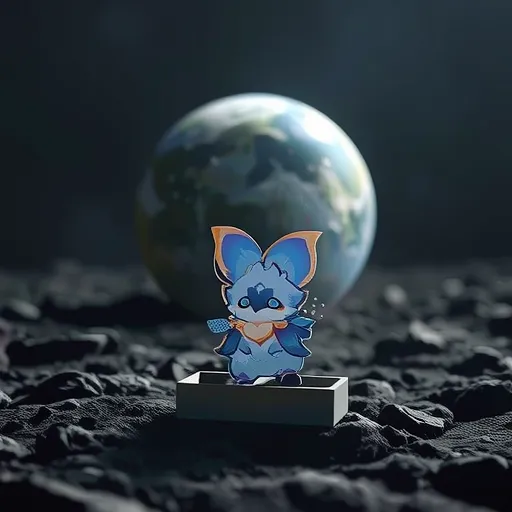
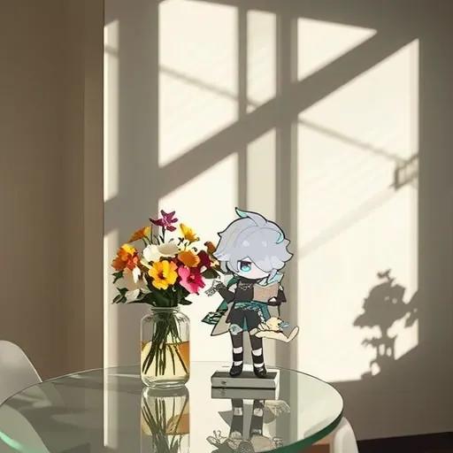
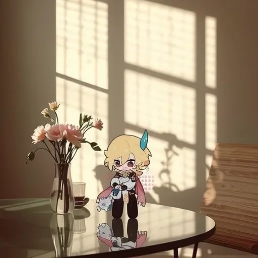
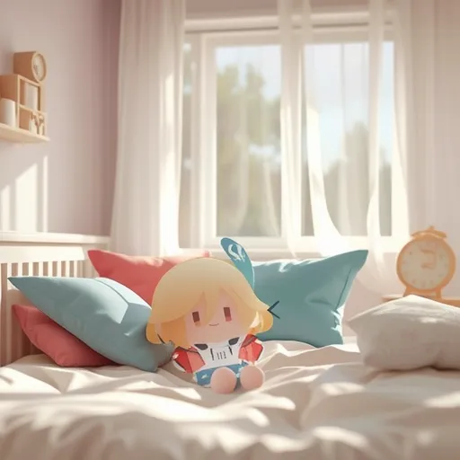

# OminiControl


<br>

<a href="https://arxiv.org/abs/2411.15098"></a>
<a href="https://huggingface.co/Yuanshi/OminiControl"></a>
<a href="https://huggingface.co/spaces/Yuanshi/OminiControl"></a>
<a href="https://github.com/Yuanshi9815/Subjects200K"></a>

```bash
sudo apt-get update && sudo apt-get install git-lfs cbm ffmpeg
git clone https://huggingface.co/spaces/svjack/OminiControl && cd OminiControl && pip install -r requirements.txt
python app.py
```

## Genshin Impact Products Examples 
# Image Files

## References
- **IMG_bat_ref.jpeg**
  <div style="display: flex; flex-direction: column; align-items: center;">
    
  </div>
- **IMG_hs_ref.jpeg**
  <div style="display: flex; flex-direction: column; align-items: center;">
    
  </div>
- **IMG_kv_ref.jpeg**
  <div style="display: flex; flex-direction: column; align-items: center;">
    
  </div>

## Generated Images

### Cards
- **IMG_bat_gen.webp**
  <div style="display: flex; flex-direction: column; align-items: center;">
    
    <p><strong>Prompt:</strong> A film style shot. On the moon, this item on the moon surface. The background is that Earth looms large in the foreground.</p>
  </div>
- **image_hs_card_gen.webp**
  <div style="display: flex; flex-direction: column; align-items: center;">
    
    <p><strong>Prompt:</strong> In a Bauhaus style room, this item is placed on a shiny glass table, with a vase of flowers next to it. In the afternoon sun, the shadows of the blinds are cast on the wall.</p>
  </div>
- **image_kv_card_gen.webp**
  <div style="display: flex; flex-direction: column; align-items: center;">
    
    <p><strong>Prompt:</strong> In a Bauhaus style room, this item is placed on a shiny glass table, with a vase of flowers next to it. In the afternoon sun, the shadows of the blinds are cast on the wall.</p>
  </div>

### Dolls
- **image_hs_doll_gen.webp**
  <div style="display: flex; flex-direction: column; align-items: center;">
    
    <p><strong>Prompt:</strong> This item, a charming doll, nestles in a plush bed surrounded by colorful pillows in a pastel-colored bedroom. Its velvety fabric feels luxuriously soft, while its downy-stuffed limbs offer a huggable plumpness. A gentle breeze from the open window rustles sheer curtains, casting delicate light patterns on the floor. A small wooden nightstand holds a tiny lamp, casting a warm glow. The room's faint lavender scent and the distant clock's soft hum create a tranquil ambiance.</p>
  </div>
- **image_kv_doll_gen.webp**
  <div style="display: flex; flex-direction: column; align-items: center;">
    
    <p><strong>Prompt:</strong> This item, a charming doll, nestles in a plush bed surrounded by colorful pillows in a pastel-colored bedroom. Its velvety fabric feels luxuriously soft, while its downy-stuffed limbs offer a huggable plumpness. A gentle breeze from the open window rustles sheer curtains, casting delicate light patterns on the floor. A small wooden nightstand holds a tiny lamp, casting a warm glow. The room's faint lavender scent and the distant clock's soft hum create a tranquil ambiance.</p>
  </div>

# Use LTX Video I2V to make video (https://github.com/svjack/LTX-Video) 

## Bat_card_LTX_Video.mp4
<div style="display: flex; flex-direction: column; align-items: center;">
  <video controls style="max-width: 100%;">
    <source src="Bat_card_LTX_Video.mp4" type="video/mp4">
  </video>
  <p><strong>Prompt:</strong> A film style shot. On the moon, this item on the moon surface. The background is that Earth looms large in the foreground.</p>
</div>

## Hs_card_LTX_Video.mp4
<div style="display: flex; flex-direction: column; align-items: center;">
  <video controls style="max-width: 100%;">
    <source src="Hs_card_LTX_Video.mp4" type="video/mp4">
  </video>
  <p><strong>Prompt:</strong> In a Bauhaus style room, this item is placed on a shiny glass table, with a vase of flowers next to it. In the afternoon sun, the shadows of the blinds are cast on the wall.</p>
</div>

## Hs_doll_LTX_Video.mp4
<div style="display: flex; flex-direction: column; align-items: center;">
  <video controls style="max-width: 100%;">
    <source src="Hs_doll_LTX_Video.mp4" type="video/mp4">
  </video>
  <p><strong>Prompt:</strong> This item, a charming doll, nestles in a plush bed surrounded by colorful pillows in a pastel-colored bedroom. Its velvety fabric feels luxuriously soft, while its downy-stuffed limbs offer a huggable plumpness.</p>
</div>


<br/><br/>


> **OminiControl: Minimal and Universal Control for Diffuison Transformer**
> <br>
> Zhenxiong Tan, 
> [Songhua Liu](http://121.37.94.87/), 
> [Xingyi Yang](https://adamdad.github.io/), 
> Qiaochu Xue, 
> and 
> [Xinchao Wang](https://sites.google.com/site/sitexinchaowang/)
> <br>
> [Learning and Vision Lab](http://lv-nus.org/), National University of Singapore
> <br>


## Features

OmniControl is a minimal yet powerful universal control framework for Diffusion Transformer models like [FLUX](https://github.com/black-forest-labs/flux).

* **Universal Control 🌐**:  A unified control framework that supports both subject-driven control and spatial control (such as edge-guided and in-painting generation).

* **Minimal Design 🚀**: Injects control signals while preserving original model structure. Only introduces 0.1% additional parameters to the base model.

## Quick Start
### Setup (Optional)
1. **Environment setup**
```bash
conda create -n omini python=3.10
conda activate omini
```
2. **Requirements installation**
```bash
pip install -r requirements.txt
```
### Usage example
1. Subject-driven generation: `examples/subject.ipynb`
2. In-painting: `examples/inpainting.ipynb`
3. Canny edge to image, depth to image, colorization, deblurring: `examples/spatial.ipynb`

## Generated samples
### Subject-driven generation
<a href="https://huggingface.co/spaces/Yuanshi/OminiControl"></a>

**Demos** (Left: condition image; Right: generated image)

<div float="left">
  
  
  
  
</div>

<details>
<summary>Text Prompts</summary>

- Prompt1: *A close up view of this item. It is placed on a wooden table. The background is a dark room, the TV is on, and the screen is showing a cooking show. With text on the screen that reads 'Omini Control!.'*
- Prompt2: *A film style shot. On the moon, this item drives across the moon surface. A flag on it reads 'Omini'. The background is that Earth looms large in the foreground.*
- Prompt3: *In a Bauhaus style room, this item is placed on a shiny glass table, with a vase of flowers next to it. In the afternoon sun, the shadows of the blinds are cast on the wall.*
- Prompt4: *In a Bauhaus style room, this item is placed on a shiny glass table, with a vase of flowers next to it. In the afternoon sun, the shadows of the blinds are cast on the wall.*
</details>
<details>
<summary>More results</summary>

* Try on:
  
* Scene variations:
  
* Dreambooth dataset:
  
</details>

### Spaitally aligned control
1. **Image Inpainting** (Left: original image; Center: masked image; Right: filled image)
  - Prompt: *The Mona Lisa is wearing a white VR headset with 'Omini' written on it.*
    </br>
    
  - Prompt: *A yellow book with the word 'OMINI' in large font on the cover. The text 'for FLUX' appears at the bottom.*
    </br>
    
2. **Other spatially aligned tasks**  (Canny edge to image, depth to image, colorization, deblurring) 
    </br>
    <details>
    <summary>Click to show</summary>
    <div float="left">
      
      
      
      
    </div>
    
    Prompt: *A light gray sofa stands against a white wall, featuring a black and white geometric patterned pillow. A white side table sits next to the sofa, topped with a white adjustable desk lamp and some books. Dark hardwood flooring contrasts with the pale walls and furniture.*
    </details>
   


## Models

**Subject-driven control:**
| Model                                                                                            | Base model     | Description                                                                                              | Resolution   |
| ------------------------------------------------------------------------------------------------ | -------------- | -------------------------------------------------------------------------------------------------------- | ------------ |
| [`experimental`](https://huggingface.co/Yuanshi/OminiControl/tree/main/experimental) / `subject` | FLUX.1-schnell | The model used in the paper.                                                                             | (512, 512)   |
| [`omini`](https://huggingface.co/Yuanshi/OminiControl/tree/main/omini) / `subject_512`           | FLUX.1-schnell | The model has been fine-tuned on a larger dataset.                                                       | (512, 512)   |
| [`omini`](https://huggingface.co/Yuanshi/OminiControl/tree/main/omini) / `subject_1024`          | FLUX.1-schnell | The model has been fine-tuned on a larger dataset and accommodates higher resolution.   (To be released) | (1024, 1024) |

**Spatial aligned control:**
| Model                                                                                                     | Base model | Description                                                                | Resolution   |
| --------------------------------------------------------------------------------------------------------- | ---------- | -------------------------------------------------------------------------- | ------------ |
| [`experimental`](https://huggingface.co/Yuanshi/OminiControl/tree/main/experimental) / `<task_name>`      | FLUX.1     | Canny edge to image, depth to image, colorization, deblurring, in-painting | (512, 512)   |
| [`experimental`](https://huggingface.co/Yuanshi/OminiControl/tree/main/experimental) / `<task_name>_1024` | FLUX.1     | Supports higher resolution.(To be released)                                | (1024, 1024) |

## Citation
```
@article{
  tan2024omini,
  title={OminiControl: Minimal and Universal Control for Diffusion Transformer},
  author={Zhenxiong Tan, Songhua Liu, Xingyi Yang, Qiaochu Xue, and Xinchao Wang},
  journal={arXiv preprint arXiv:2411.15098},
  year={2024}
}
```
